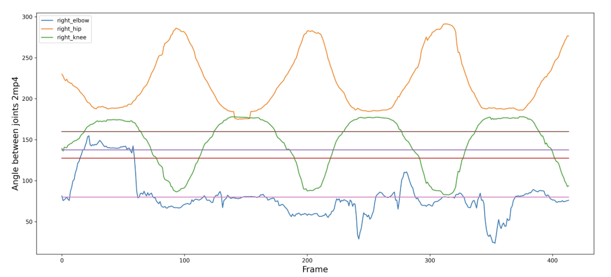

# Push-Up Detector - Team YOLO


# Project
This project aims to create a push-up posture evaluator based on deep neural networks. We created a deep-learning model that evaluates the posture of push-ups based on the angle of the joints.  
In this project, we used YOLO7-W6-pose-model and PyTorch library on Jetson NANO.  
 
## Demo


## Team
YOLO (You Only Look Once) (You Only Live Once)
- 김규진 (Kim Gyu_jin) [Github](https://github.com/doneisdone36) [contact_mail](doneisdone36@gmail.com)
- 박태현 (Park Tae_hyun) [Github]() [contact_mail](pth0325@gmail.com)
- 김연주 (Kim Yeon_ju) [Github]() [contact_mail](yeonju4098@naver.com)


## Motivation
- As the COVID-19 virus hits the world, the number of people who want to exercise for their health is increasing. In addition, there are more people who do home training alone at home instead of sports facilities used by many people, but it is not easy to know if they are exercising in an accurate position because they exercise alone. If you exercise too hard in an unstable position, you can get injured.


- We want to increase the effectiveness of exercise and reduce the risk of injury through correct posture by creating a program that tells us whether we have the correct posture and checks how much strain we have on our joints.

## Packages
 - Jetpack 4.6.1
 - Python 3.6
 - Pytorch 1.9.0
 - Torch-vision 0.10.0
 - OpenCV 4.6.0
 - Numpy, pandas, seaborn, matplotliab ...


## Installation
1. first download jetpack 4.6.1
 - [Offical_Downlaod_jetpack_4.6.1](https://developer.nvidia.com/embedded/l4t/r32_release_v7.1/jp_4.6.1_b110_sd_card/jeston_nano/jetson-nano-jp461-sd-card-image.zip)
2. Making bootable device 
 - [Offical_balena](https://www.balena.io/etcher/)
 - [Help Link](https://www.balena.io/blog/getting-started-with-the-nvidia-jetson-nano-using-balena/) 

```bash
$ git clone https://github.com/doneisdone36/JetBot_YOLO.git
$ cd JetBot_YOLO  
$ sh jetson_setup/opencv.sh # almost 3 hours
$ sh jetson_setup/essential_build.sh # Our files move into yolov7[WongKinYiu](https://github.com/WongKinYiu/yolov7) folders

```

## Getting Started
 - After installing
```bash
$ python3 yolov7_push_up.py --source 0 [ --drawskeleton -Tracker ] # webcam
```

## Goal (remake)


## yolov7-w6-pose vs mediapipe
```
Something -> graph ? / FPS

```

## Code Block
 load image to cv2 [yolov7-w6-pose baseline](https://github.com/WongKinYiu/yolov7/blob/main/tools/instance.ipynb)
```python
# yolov7_push.py
ret,frame = cap.read()
if ret:
    start_time = time.time()
    orig_frame = frame
    image = cv2.cvtColor(orig_frame, cv2.COLOR_BGR2RGB)
    
    if webcam :
        image = cv2.resize(image, (fw,fh), interpolation=cv2.INTER_LINEAR)
        
    image = letterbox(image, (fw), stride=64, auto=True)[0]
    image = transforms.ToTensor()(image)
    image = torch.tensor(np.array([image.numpy()]))
    
    image = image.to(device)
    image = image.float()
    
    output, _ = model(image)
        
    output = non_max_suppression_kpt(
        output, 0.5, 0.65, nc = model.yaml['nc'], nkpt = model.yaml['nkpt'], kpt_label=True
    )
    
    output = output_to_keypoint(output)
    img = image[0].permute(1, 2, 0) * 255
    img = img.cpu().numpy().astype(np.uint8)
    img = cv2.cvtColor(img, cv2.COLOR_RGB2BGR)
                
```
Push up Angle
```python
## estimate elbow up and down
elbow_right_angle = Angle(img, output[idx, 7:].T,5,7,9, draw=True)
Is_elbow_up = elbow_right_angle > 130
Is_elbow_down = elbow_right_angle < 110
temp['elbow_right'].append(elbow_right_angle)
print(f'elbow angle {elbow_right_angle}')

## estimate knee up and down
knee_right_angle = Angle(img, output[idx, 7:].T,11,13,15, draw=True)
knee_condition = (knee_right_angle > 130) and (knee_right_angle < 220)
temp['knee_right'].append(knee_right_angle)
print(f'knee angle : {knee_right_angle}')


lower_body_condition =  knee_condition

Is_pushup_angle = (elbow_right_angle > 140)  and  (knee_right_angle > 125)  
if Is_pushup_angle :
    Is_Start = True
    print("success")

```
getAngle
```python
def Angle(image, kpts, p1,p2,p3, draw = True):
    coords = []
    no_kpts = len(kpts)//3
    for i in range(no_kpts):
        cx,cy = kpts[3*i], kpts[3*i + 1]
        conf = kpts[3*i + 2]
        coords.append([i, cx,cy, conf])
        
    points = (p1,p2,p3)

    
    x1,y1 = coords[p1][1:3]
    x2,y2 = coords[p2][1:3]
    x3,y3 = coords[p3][1:3]
    
    
    angle = math.degrees(math.atan2(y3-y2, x3-x2) - math.atan2(y1-y2,x1-x2))

```
## Version_Log
branch
 - jetson_install -> jetson_setup(0.0.4)
 - estimation -> estimate person push-up(latest: 0.0.4)

